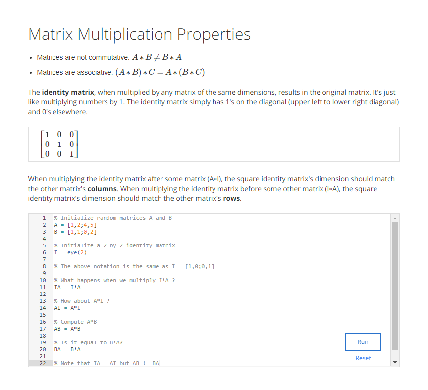

# Machine Learning - Andrew Ng

## Introduction 

### What is Machine Learning

### Examples
* Facial Recognition
* Speech Recognition
* Handwriting Recognition
* Search Engines
* Spam Filtering
* Understanding Human Genome
* Recommendation Systems

### Supervised Learning

### Unsupervised Learning

## Model and Cost Function

### Model Representation

###  Cost Function

### Cost Function Intuition 

## Paramter Learning

### Gradient Descent

### Gradient Descent Intuition

### Gradient for Linear Regression

## Linear Algebra Review

### Matrices and Vectors

### Addition and Scalar Multiplication

### Matrix Vector Multiplication

### Matrix Matrix Multiplication

### Matrix Multiplication Properties

### Inverse and Transpose

